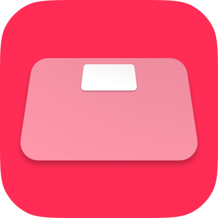

# iPhoneApp TapWeight / 体重登録 for "Health"

 

 

## 🔗 AppStore link

[apps.apple.com/app/id1624159721](https://apps.apple.com/app/id1624159721)

<!-- Manually sync below text between and "Localizable.strings" and "AppStoreConnect/_/Description". -->

## 📄 Description

<!--==== English Description ====-->

This application is designed to register weight data to the Apple "Health" application pre-installed on iPhone in the fastest possible way (as manual).

People frequently measure their weight and body fat percentage daily using a scale. Many iPhone users register their weight and body fat percentage data on "Health" app. The best solution is to use a smart scale that works with "Health" app and automatically stores measurements, but they are expensive and inaccessible. Manual data registration is possible in "Health" app, but "Health" app is not designed for daily manual data registration. Therefore, manually entering data that occur continuously daily, such as weight measurements, is a very time-consuming and stressful experience. This app was developed to solve such problems.

This app cannot read, view, or manage past data in "Health" app. This app is intended only to register data to the "Health" app. Please check the registered data on the "Health" app.

【Target/Use-case】

- No "smart" scale.

- Frequently measure my weight (and body fat percentage) using a scale almost every day.

- Intend to register the data into "Health" app every time, after measuring by a scale.

【OPTION】

- Unit: kg, lbs, st

- 100g/50g amount option.

- With body mass index automatically.

- With body fat percentage.

- Function to change the registration date and time

- Option to hide AD banner. (In-App-Purchase)

【OTHERS】

- Launch "Health" app by one tap.

- Cancel feature just after registration.

- Local history for the purpose of "operation check" / "temporary backup".

- Check source code in app.

- All feature is free.

- AD banner of apps by TapWeight developer.

==== Japanese(native) Description ====

iPhoneにプリインストールされているApple「ヘルスケア」アプリに体重データを(手動としては)最速で登録するためのアプリです。

人々は体重計を用いて体重や体脂肪率は日々頻繁に計測します。多くのiPhoneユーザーは「ヘルスケア」アプリ上に体重や体脂肪率のデータを登録しています。「ヘルスケア」アプリと連携して自動的に計測データを保存してくれるスマート体重計を用いることが最高の解決策ではありますが、それらは高価であったり入手性が低かったりします。「ヘルスケア」アプリ上で手動でもデータ登録は可能ですが、残念ながら「ヘルスケア」アプリは計測データを日常的に手動で登録することを想定されていません。そのため体重測定のような日々継続的に発生するデータを手動で入力することは大いに手間が掛かりストレスフルな体験になります。そうした課題を解決するためにこのアプリは開発しました。

このアプリでは「ヘルスケア」アプリ上の過去のデータの読み込みや閲覧、管理等は出来ません。このアプリは「ヘルスケア」アプリへのデータ登録のみを目的としています。登録したデータは「ヘルスケア」アプリ上で確認してください。

【想定ユーザー/ユースケース】

- スマート体重計を持っていない。

- 日常的に体重や体脂肪率を体重計で計測している。

- 体重計で測定した直後、毎回手動で測定結果を「ヘルスケア」アプリに登録する事を検討している。

【オプション】

- 単位: kg, lbs, st

- 入力単位を100gから50gへ変更可能。

- BMIを自動的に計算して同時に登録可能。

- 体脂肪率も同時に登録可能。

- 登録日時を変更できる機能。

- 広告バナー非表示オプション。(アプリ内課金)

【その他】

- このアプリ内からApple「ヘルスケア」アプリをワンタップで立ち上げ可能。

- 登録直後に登録を取り消し可能。

- 動作確認や簡易バックアップを想定した端末内での履歴機能。

- アプリ内でアプリ自身のソースコードを確認。

- すべての機能を無料で利用できます。

- 自作アプリに関するバナー広告をアプリ内で表示します。

 

## 🧰 Source code link

[github.com/FlipByBlink/TapWeight](https://github.com/FlipByBlink/TapWeight)

### Source code (Mirror) link

[gitlab.com/FlipByBlink/TapWeight_Mirror](https://gitlab.com/FlipByBlink/TapWeight_Mirror)

## ✉️ Contact

sear_pandora_0x@icloud.com

 

 

------

 

 

## Privacy Policy for AppStore

2022-05-22

### Japanese

このアプリ自身において、ユーザーの情報を一切収集しません。

### English

This application don't collect user infomation.

 

 

------

 

 

<!-- URL "Support page for AppStore" -->
<!-- https://flipbyblink.github.io/TapWeight/ -->

<!-- URL "Privacy Policy for AppStore" -->
<!-- https://github.com/FlipByBlink/TapWeight#privacy-policy-for-appstore -->
